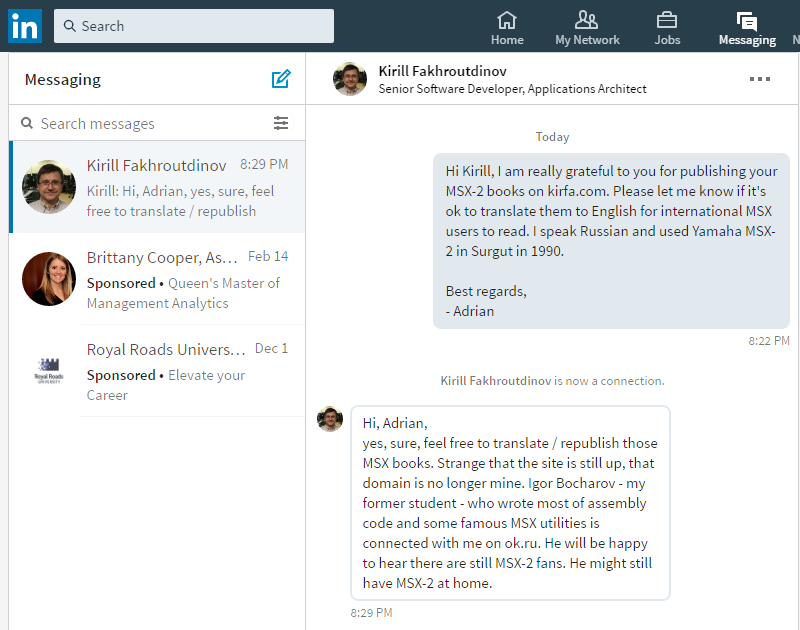

Книги про MSX на русском
========================

## [Архитектура и устройства микрокомпьютеров стандарта MSX-2](msx2-fb-1993-ru.md)

К.И.Фахрутдинов, И.И.Бочаров, Издательство Дальневосточного Университета, 1993

Оригинал в Microsoft Word скачан с сайта автора [Кирилла Фахрутдинова](http://www.kirfa.com/).

Локальная копия оригинала: [msx2-fb-1993.doc.zip](original/msx2-fb-1993.doc.zip).

Изменения между версией Microsoft Word и текстовым файлом:

- "╬" -> "×" multiplication U+00D7
- "╚" -> "─" box drawing light horizontal U+2500
- "╦" -> "▼" black down-pointing triangle U+25BC
- "╩" -> "▲" black up-pointing triangle U+25B2
- "╠" -> "►" black right-pointing pointer U+25BA, тоньше U+25B6, но работает в консоли Windows 10
- "╣" -> "◄" black left-pointing pointer U+25BA, тоньше U+25C0, но работает в консоли Windows 10
- "•" -> "‐" hyphen U+2010
- " T16 >" -> ""

## [Программирование на языке ассемблера в системе MSX-2](z80-fb-1991-ru.md)

К.И.Фахрутдинов, И.И.Бочаров, Издательство Дальневосточного Института, 1991

Оригинал в Microsoft Word скачан с сайта автора [Кирилла Фахрутдинова](http://www.kirfa.com/).

Локальная копия оригинала: [z80-fb-1991.doc.zip](original/z80-fb-1991.doc.zip).

## Разрешение на распространение и перевод

16 Февраля 2017-го года Кирилл Фахрутдинов разрешил распространять и переводить его книги про MSX.
Огромное спасибо, Кирилл Ильнурович!

